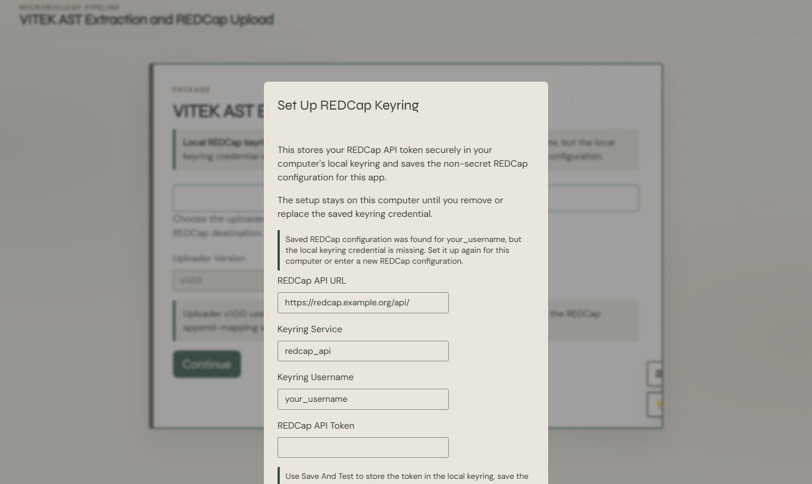

# How to Configure REDCap and the Local Keyring

VITEK-EXTRACT separates non-secret connection settings from the API token:

- `config/redcap_config.yml` stores the REDCap API URL, keyring service name, and keyring username.
- The operating system keyring stores the API token.

This design reduces the risk of accidentally committing a token to the public repository.

## Before you begin

Ask your REDCap administrator to confirm:

- the correct API endpoint, usually ending in `/api/`;
- that the REDCap API is enabled for the project;
- that your account has appropriate import/export permissions;
- the project record identifier and any event or repeating-instrument design;
- whether you should create records, update existing records, or both;
- which project data dictionary is current;
- whether institutional approval is required for this transfer.

> [!CAUTION]
> API permissions can allow large changes to a REDCap project. Use a test project and dry runs before connecting to production.

## Set up the connection in the application

1. Start VITEK-EXTRACT.
2. On the landing page, select **Set Up REDCap Keyring**.
3. In **REDCap API URL**, replace the example URL with your institution's API endpoint.
4. In **Keyring Service**, use `redcap_api` unless your team has assigned another service name.
5. In **Keyring Username**, enter a stable local label for the credential. This does not need to be the REDCap login name, but it must match the value used to retrieve the token later.
6. In **REDCap API Token**, paste the project-specific token.
7. Select **Save And Test Keyring**.
8. Read the resulting status message. Do not continue to production work until the token can be read and the configuration points to the intended project.



## Understand the setup buttons

| Button | Use it when... | Effect |
|---|---|---|
| **Save And Test Keyring** | Setting up or replacing a connection | Saves non-secret settings, stores the token locally, and tests whether it can be retrieved |
| **Save And Exit** | You need to store settings but cannot perform the additional check yet | Saves the setup and closes the dialog |
| **Test Existing Setup** | A connection was configured previously | Tests the saved configuration and local credential |
| **Clear Existing Setup** | The credential is wrong, expired, or assigned to the wrong project | Removes or resets the saved local setup after confirmation |
| **Close** | You do not want to change anything | Leaves the current setup unchanged |

## Interpret the landing-page status

### Configuration and token found

The computer has both the non-secret settings and a retrievable keyring credential. You must still confirm that the token belongs to the correct REDCap project.

### Configuration found, credential missing

The YAML file exists, but the operating system keyring does not contain the matching token. This can happen after moving the project to another computer. Select **Set Up REDCap Keyring** and enter the token on that computer.

### No saved configuration

The application is using placeholder or incomplete settings. Enter the institutional API endpoint and local keyring details before attempting an upload.

## Test-project procedure

1. Create or obtain access to a non-production REDCap project with a representative data dictionary.
2. Configure a token limited to that project.
3. Process synthetic or de-identified VITEK reports.
4. Perform a dry run.
5. Inspect the proposed keys, fields, values, and row counts.
6. Perform a small live upload to the test project.
7. Compare the REDCap records with the source reports and expected output.
8. Document approval before configuring the production project.

## Token safety rules

- Never commit a token to Git.
- Never store a token in `.Renviron`, a mapping CSV, a screenshot, or a manuscript.
- Never paste a token into a public issue or chat.
- Do not share tokens between users.
- Revoke and replace a token that may have been exposed.
- Follow institutional rotation and offboarding requirements.
- Lock the workstation when unattended; the keyring is local to that computer.

## Configuration file example

The committed file intentionally contains neutral placeholders:

```yaml
redcap_uri: "https://redcap.example.org/api/"
keyring_service: "redcap_api"
keyring_username: "your_username"
```

Do not replace the example URL in the public repository with an internal institutional address. Configure the working copy used on the approved computer.

## Next step

Continue to [Choose an uploader workflow](03-choose-a-workflow.md).
