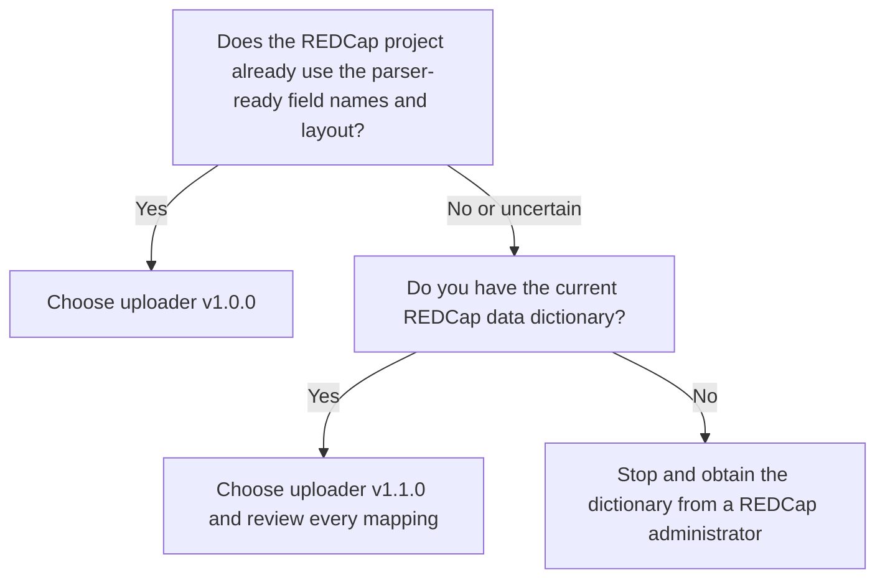
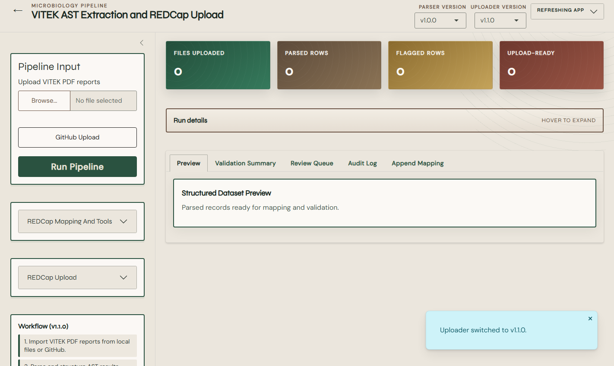

# How to Choose an Uploader Workflow

VITEK-EXTRACT provides two uploader paths. Both use the same parser and structural validation process, but they prepare REDCap fields differently.

## Quick decision

## Comparison

| Question | Uploader `v1.0.0` | Uploader `v1.1.0` |
|---|---|---|
| Intended destination | A project aligned with the parser-ready schema | An existing project with its own variable names |
| Mapping method | Base parser-to-REDCap mapping in `docs/redcap_variable_mapping.csv` | REDCap dictionary-assisted append mapping |
| User mapping review | Confirm the base project design | Required before accepting or uploading a mapping |
| Update style | Direct upload of validated rows | Mapped partial updates intended to preserve unrelated fields |
| Key field | `patient_id` by default | `patient_id` is marked as the primary lookup field in the supplied append template |
| Main risk | Destination schema may not actually match the parser output | A plausible but incorrect suggested mapping may update the wrong field |

## Choose uploader v1.0.0 when

- the REDCap project was designed from the supplied parser schema or data dictionary;
- source and destination variable names have been verified;
- the project event and record-key expectations match the application output;
- your team wants the simpler direct-upload path.

See [Use uploader v1.0.0](05-uploader-v1.md).

## Choose uploader v1.1.0 when

- the destination project already exists and uses different variable names;
- you can export its current REDCap data dictionary;
- only selected mapped fields should be written;
- a knowledgeable user will review suggested target fields and key behavior.

See [Use uploader v1.1.0](06-uploader-v1-1.md).

## Do not choose based only on the version number

`v1.1.0` is not automatically the better route. It is the mapping-aware route. The correct selection depends on the REDCap project design.

The interface also displays a separate **Parser Version** control. Parser `v1.1.0` is marked as in development and cannot be selected for routine use. Do not confuse the parser version with the uploader version.

## Questions for the REDCap administrator

Before proceeding, ask:

1. What is the project's unique record identifier?
2. Is `patient_id` permitted and unique for the intended operation?
3. Is the project longitudinal, and what event name is required?
4. Are any destination fields calculated, protected, or read-only?
5. Are organisms or other fields coded choices rather than free text?
6. Should blank incoming values overwrite populated REDCap values?
7. Are repeating instruments or repeat instances involved?
8. Has the data dictionary changed since the mapping was prepared?

## Stop conditions

Do not upload when:

- you cannot identify the correct project key;
- the data dictionary is outdated;
- a suggested mapping has not been reviewed;
- the preview contains identifiers from the wrong study or batch;
- the dry-run row count differs from expectation;
- an unsupported report/card format appears in the batch;
- the review queue contains unresolved records.

## Next step

Continue to [Process VITEK PDF reports](04-process-reports.md), then follow the uploader-specific procedure.
