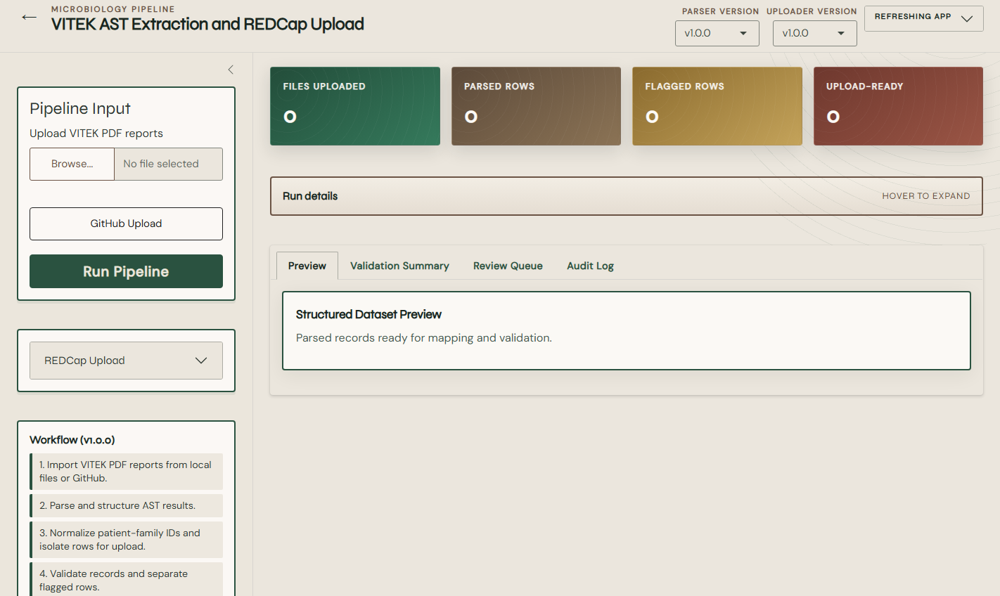

# How to Process VITEK PDF Reports

This procedure imports text-based VITEK reports, extracts the report content, parses supported AST patterns, cleans the records, maps fields, and creates a reviewable run folder.

## Before you begin

- Work only with files you are authorized to process.
- Keep identifiable reports on an approved device and storage location.
- Separate unrelated studies, laboratories, or REDCap destinations into different runs.
- Confirm that the PDF contains selectable text. Image-only scans require OCR before they can be parsed, and OCR output must be validated separately.
- Use a small, known batch for the first run.

## Supported parser scope

Parser `v1.0.0` contains card-specific dictionaries and rules for:

- `AST-GN75`
- `AST-GP75`
- `AST-YS08`

The parser may infer a card type from recognized antimicrobial names when the card heading is unavailable. An unsupported card or changed report layout should be treated as unsupported until it is tested and added deliberately.

## Method 1: Upload local PDFs

1. Start the app and choose the uploader workflow.
2. Select **Continue**.
3. In **Pipeline Input**, select **Browse**.
4. Choose one or more `.pdf` files.
5. Confirm that the selected filenames belong to the same intended processing batch.
6. Select **Run Pipeline**.
7. Wait for the status banner and metric cards to update.

## Method 2: Import PDFs from GitHub

1. Select **GitHub Upload**.
2. Enter the public or accessible GitHub repository/subtree link requested by the interface.
3. Start the import.
4. Confirm the number of imported records shown by the application.
5. Select **Run Pipeline**.

The importer attempts to limit retrieval to the selected subtree, prefers PDF files, and can extract PDFs from ZIP files in that subtree. Imported files are staged under `data_raw/`.

> [!WARNING]
> Do not place identifiable VITEK reports in a public GitHub repository. The GitHub import option is suitable only for synthetic, de-identified, or otherwise approved files.

## What the pipeline does

1. Creates a timestamped run directory.
2. Saves an input manifest.
3. Extracts page text with `pdftools`.
4. Identifies report metadata with label and regular-expression rules.
5. Locates the AST result block.
6. Parses antimicrobial, MIC, susceptibility interpretation, and modification-status values.
7. Builds long and wide data representations.
8. Cleans field values and handles multiple isolate rows.
9. Maps parser fields to REDCap field names.
10. Adds `redcap_event_name = microbiology` in the standard pipeline.
11. Runs structural validation.
12. Separates passing rows from rows that require review.
13. Writes outputs and an audit trail.

## Understand the parsed record

For each antimicrobial, the wide record can contain fields such as:

| Field pattern | Meaning | Example form |
|---|---|---|
| `<antibiotic>_mic` | MIC or marker-test value retained as text | `<=1`, `>=64`, `POS` |
| `<antibiotic>_interpretation_raw` | Raw susceptibility or marker interpretation | `S`, `I`, `R`, `+`, `-` |
| `<antibiotic>_interpretation` | Interpretation status/note | `standard`, `aes_modified`, `user_modified` |

MIC values are treated as character strings so comparison operators and special values are not discarded.

## Multiple organisms and report versions

- The cleaner derives a normalized patient-family identifier from `patient_id`.
- The first distinct organism uses the base fields.
- A second or third distinct organism uses `_2` and `_3` field groups.
- Repeated reports for the same organism remain separate upload rows.
- Report version information can contribute to the working patient identifier used during grouping.

Inspect these transformations carefully. They are operational rules, not universal microbiology data standards.

## Read the first results

1. **Files Uploaded** should match the intended batch.
2. **Parsed Rows** may differ from the file count when report/isolate structure requires multiple rows.
3. **Flagged Rows** identifies records stopped by structural checks.
4. **Upload-Ready** identifies rows that passed those checks.
5. Open **Preview** and compare representative records with the original PDFs.
6. Open **Validation Summary** and note each issue category.
7. Open **Review Queue** and investigate every row.
8. Open **Audit Log** and confirm that parsing and validation completed.

## If one report fails

The current pipeline stops and writes the failing filename, normalized path, and parser error to the run audit log. Remove the unsupported or malformed file from the batch, document it, and retry the supported files. Do not silently discard the failed report from the study dataset.

## Next step

- For a parser-aligned project, continue to [Use uploader v1.0.0](05-uploader-v1.md).
- For an existing project with different fields, continue to [Use uploader v1.1.0](06-uploader-v1-1.md).
