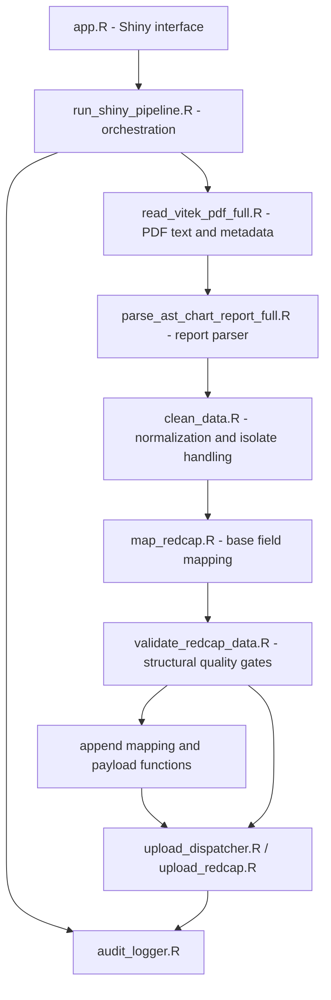

# Developer and Command-Line Guide

This page explains the repository structure, scripted pipeline entry points, tests, and the process for extending the parser safely.

## Architecture



## Important directories

| Path | Responsibility |
|---|---|
| `app.R` | Shiny user interface and interaction orchestration |
| `functions/` | Extraction, parsing, cleaning, mapping, validation, upload, imports, and audit functions |
| `scripts/` | Command-line runners, package checks, setup utilities, and manifest operations |
| `tests/testthat/` | Automated regression and behavior tests |
| `docs/` | REDCap dictionaries, mapping templates, saved mappings, and this guide |
| `config/` | Non-secret REDCap configuration |
| `data_raw/` | Local PDF staging area; generated contents ignored by Git |
| `output/` | Per-run, cache, mapping, and upload artifacts; generated contents ignored by Git |

## Run one PDF from the command line

From the project root:

```powershell
Rscript scripts\run_pipeline.R data_raw\your_report.pdf
```

Do not use a real report in a public shell transcript or shared demonstration.

## Run a batch

Prepare the local batch according to the script's manifest/input expectations, then run:

```powershell
Rscript scripts\run_pipeline_batch.R
```

Review generated outputs before any upload step.

## Run tests

```powershell
Rscript tests\testthat.R
```

or use the platform launchers:

```powershell
.\run_tests.ps1
```

```bat
run_tests.bat
```

The complete suite must pass before merging parser, cleaning, mapping, validation, or upload changes.

## Add support for a report/card safely

1. Obtain authorized, representative examples covering common and difficult cases.
2. Create synthetic equivalents for permanent tests and public review.
3. Inspect the extracted page text, not only the visual PDF layout.
4. Add the minimum specific parsing rule or card dictionary required.
5. Preserve MIC operators, marker-test values, and interpretation modifiers.
6. Add tests for successful parsing, absent headings, missing values, modified interpretations, and rejection of unsupported structures.
7. Test that existing cards still parse correctly.
8. Validate outputs against an expert-labelled reference set.
9. Update the supported-card documentation and version notes.

Avoid a permissive fallback that converts unknown text into apparently valid records. A visible failure is safer than a plausible but incorrect laboratory value.

## Change a mapping

1. Confirm whether the change belongs in the base mapping or a project-specific saved append mapping.
2. Check source and destination field meaning and type.
3. Add a test for the changed behavior.
4. Perform a dry run against a test REDCap project.
5. Version the mapping and document the applicable data-dictionary version.

Do not commit project-specific mappings that disclose protected project design or identifiers.

## Change validation rules

1. Define the issue that the rule detects.
2. Decide whether it should flag, reject, or normalize a value.
3. Add positive and negative test cases.
4. Check marker tests separately from MIC-based tests.
5. Assess whether the change alters existing `Pass`/`Flagged` decisions.
6. Document the change for users and revalidate affected workflows.

## Release checklist

- [ ] Working tree reviewed.
- [ ] No sensitive artifacts staged.
- [ ] `app.R` parses and constructs.
- [ ] All tests pass.
- [ ] Environmental warnings reviewed and reported accurately.
- [ ] Documentation matches the interface.
- [ ] Parser/uploader versions are unambiguous.
- [ ] Test-project dry run completed for upload changes.
- [ ] GPL-3.0 license retained.
- [ ] Release tag and commit recorded.

## Contributing

Create a focused branch, include tests and documentation with behavioral changes, and avoid unrelated refactoring. Public examples must be synthetic or properly de-identified and approved for release.

Return to the [guide home](README.md) or read the [Glossary and FAQ](12-glossary-and-faq.md).
