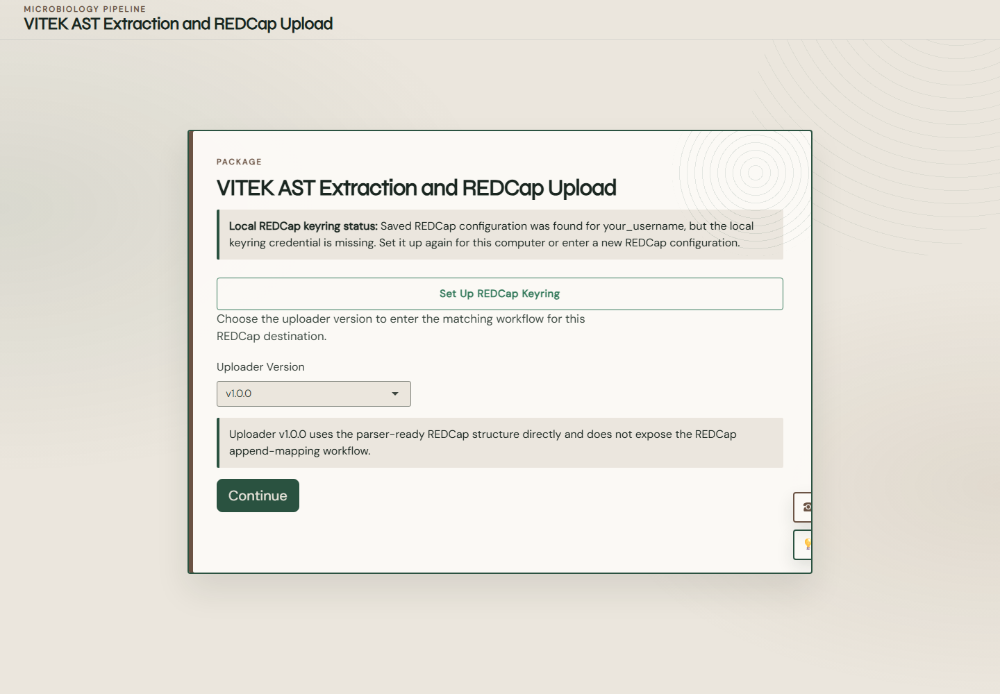
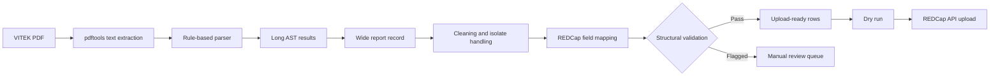

# How to Use VITEK-EXTRACT

VITEK-EXTRACT is an R/Shiny application that turns supported VITEK 2 COMPACT PDF reports into structured, reviewable records and prepares validated rows for REDCap.

This guide is written as a practical, step-by-step manual. Start with the quick route below, or choose a procedure from the guide map.

> [!IMPORTANT]
> VITEK-EXTRACT assists with data extraction and transfer. It does not replace microbiology review, clinical interpretation, or local quality-control procedures. A row marked `Pass` has passed the software's structural checks; it has not automatically been certified as clinically correct.

## Guide map

| If you need to... | Read... |
|---|---|
| Prepare a computer and install the application | [Install VITEK-EXTRACT](01-installation.md) |
| Connect the application to REDCap securely | [Configure REDCap and the local keyring](02-redcap-setup.md) |
| Choose between uploader `v1.0.0` and `v1.1.0` | [Choose an uploader workflow](03-choose-a-workflow.md) |
| Process local or GitHub-hosted PDFs | [Process VITEK PDF reports](04-process-reports.md) |
| Upload to a parser-aligned REDCap project | [Use uploader v1.0.0](05-uploader-v1.md) |
| Map into an existing REDCap project | [Use uploader v1.1.0](06-uploader-v1-1.md) |
| Understand warnings and review flagged rows | [Review validation results](07-validation-and-review.md) |
| Find outputs and reconstruct a run | [Use outputs and audit logs](08-outputs-and-audit.md) |
| Diagnose a failure | [Troubleshooting](09-troubleshooting.md) |
| Handle patient and laboratory data safely | [Privacy and operational safety](10-privacy-and-safety.md) |
| Run scripts, tests, or modify the software | [Developer and command-line guide](11-developer-guide.md) |
| Look up a term or a quick answer | [Glossary and FAQ](12-glossary-and-faq.md) |

## The 10-minute route

Use this route only after a REDCap administrator has confirmed your destination project and API permissions.

### Part 1: Start the application

1. Download or clone the public repository.
2. Open PowerShell in the `VITEK_EXTRACT` directory.
3. Run:

   ```powershell
   .\run_app.ps1
   ```

4. Wait for the application to open in your browser. If it does not open automatically, use the local address printed in the R console.



### Part 2: Configure REDCap

1. Select **Set Up REDCap Keyring**.
2. Enter the REDCap API URL supplied by your REDCap administrator.
3. Keep `redcap_api` as the service name unless your organization requires another value.
4. Enter a local keyring username.
5. Paste your REDCap API token.
6. Select **Save And Test Keyring**.


> [!WARNING]
> Never place an API token in `config/redcap_config.yml`, a screenshot, a PDF report, an issue, an email, or a Git commit. The application stores the token in the operating system's local keyring.

### Part 3: Choose the correct uploader

- Choose `v1.0.0` when the destination project already uses the field names and structure expected by the parser.
- Choose `v1.1.0` when you must map parser fields into an existing REDCap project with its own variable names.

When uncertain, stop and read [Choose an uploader workflow](03-choose-a-workflow.md). Choosing the wrong route can produce incomplete or misdirected updates.

### Part 4: Process reports

1. Select **Continue**.
2. Under **Upload VITEK PDF reports**, choose one or more text-based VITEK PDFs.
3. Select **Run Pipeline**.
4. Review **Preview**, **Validation Summary**, **Review Queue**, and **Audit Log**.
5. Correct the source data, mapping, or destination design when a result is unexpected. Run the pipeline again after a correction.
6. Keep **Dry run REDCap upload** enabled for the first upload attempt.
7. Inspect the dry-run result before performing a live upload.


## What happens to each report



The parser currently recognizes card-specific result patterns for `AST-GN75`, `AST-GP75`, and `AST-YS08`. An unsupported card, layout, image-only PDF, or changed vendor format may fail or require parser development.

## Before every live upload

- [ ] The PDF files belong to the intended batch.
- [ ] The destination REDCap project is correct.
- [ ] The selected uploader version matches the project design.
- [ ] The parser version is `v1.0.0`; the interface identifies `v1.1.0` as in development.
- [ ] Patient identifiers and report versions look correct in **Preview**.
- [ ] Organism, antimicrobial, MIC, and interpretation fields have been spot-checked against source reports.
- [ ] Every row in **Review Queue** has been investigated.
- [ ] The mapping has been reviewed by someone who understands the REDCap data dictionary.
- [ ] The dry run produced the expected rows, fields, and keys.
- [ ] A recoverable REDCap backup or export exists according to local policy.
- [ ] You are authorized to upload these records.

## Software scope

VITEK-EXTRACT performs rule-based extraction, reshaping, project-specific field mapping, structural validation, and controlled REDCap upload. It does not currently claim to provide:

- optical character recognition for image-only PDFs;
- universal support for every VITEK report or card format;
- semantic mapping to SNOMED CT, LOINC, ATC, or another common terminology;
- automatic clinical verification of AST results;
- automatic resolution of ambiguous or conflicting patient records.

## Getting help

When reporting a problem, provide the application version, operating system, R version, selected parser/uploader versions, the stage that failed, and the relevant non-sensitive audit message. Do not attach identifiable reports, raw extracted text, tokens, payloads, or logs containing patient data to a public issue.

Return to the [project README](../../README.md).
